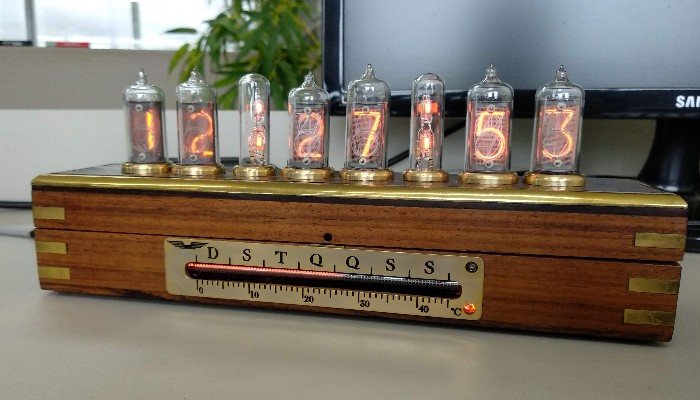

# Nixie Clock

A nixie tube clock running on a Raspberry Pi Zero: date and time on the tubes,
temperature or weekday on the bargraph. It lights up when somebody walks up to
it and is configured through a web page it serves itself.



- Syncs time over NTP and fetches the weather forecast from the internet
- Brings up its own hotspot when the home network is missing, and shows the IP on the tubes
- RGB LEDs under the tubes show the clock's state and the cloud cover
- Face and motion detection wake the display and change what it shows
- Automatic cathode regeneration (anti-poisoning) in the small hours

Author: [Luiz Cressoni](mailto:luiz@cressoni.com.br)

---

## Contents

- [What you need](#what-you-need)
- [Building the SD card](#building-the-sd-card)
- [First boot](#first-boot)
- [Configuring through the web page](#configuring-through-the-web-page)
- [How the clock works inside](#how-the-clock-works-inside)
- [Development](#development)
- [Secrets: what must never go into git](#secrets-what-must-never-go-into-git)
- [Troubleshooting](#troubleshooting)
- [Where everything goes on the card](#where-everything-goes-on-the-card)

---

## What you need

**Hardware**

| | |
|---|---|
| Board | Raspberry Pi Zero or Zero W (ARMv6) |
| Card | 8 GB or more |
| Camera | USB webcam (UVC) — `camera` opens `/dev/video0` through V4L2 |
| RTC | DS3231 on the I²C bus, to keep time through power cuts |
| Display | 6 nixie tubes + IN-9 bargraph + RGB LEDs |

Schematics, datasheets and build photos are in [`projeto/`](projeto/), and go
onto the card as well, in `/home/pi/projeto`.

**On the PC that builds the card** (tested on Ubuntu):

```bash
sudo apt-get install -y docker.io qemu-user-binfmt \
                        xz-utils curl rsync fdisk e2fsprogs openssl python3
# Ubuntu up to 24.04: qemu-user-static binfmt-support instead of qemu-user-binfmt

# docker without sudo
sudo addgroup --system docker
sudo adduser "$USER" docker
# snap installs only:
sudo snap disable docker && sudo snap enable docker
```

Then open a new terminal (or run `newgrp docker`) so the group applies.

To check QEMU: `/proc/sys/fs/binfmt_misc/qemu-arm` must exist and show an `F`
on its `flags:` line (that is what makes the emulator work inside the
container), and `docker run --rm balenalib/rpi-raspbian:bullseye uname -m` must
answer `armv6l`.

> **Why QEMU?** The Pi Zero is ARMv6. A Debian/Ubuntu armhf toolchain produces
> ARMv7 binaries, which simply do not run on it. So everything is built inside
> a real Raspberry Pi OS armhf container, emulated through `binfmt_misc` +
> `qemu-arm`. Slower, but it works.

---

## Building the SD card

```bash
git clone <this-repository-url> nixie
cd nixie

./tools/make_image.sh --password 'a-good-password'
```

That alone produces `build/nixie-clock.img`. The script:

1. downloads Raspberry Pi OS **Bullseye armhf lite** (2024-10-22) and the
   **lighttpd 1.4.78** tarball, checking the SHA-256 of both;
2. unpacks the image and grows the rootfs — the stock image has no headroom;
3. builds `nixie`, `camera`, `nixie.cgi` and `liblogger.so` in the ARM container;
4. builds lighttpd in the same container, with `--without-pcre2`;
5. installs the dependencies *inside* the image, through an emulated chroot;
6. copies binaries, pages, scripts, units and configs to their places;
7. prepares first boot: user, SSH, Wi-Fi, `config.txt`, time zone, hostname.

The first run takes a long time — building OpenCV-linked code and lighttpd
under emulation is not fast. Later runs reuse the download and the lighttpd
build.

### Useful options

```bash
./tools/make_image.sh \
  --password 'a-good-password' \
  --hostname nixie \
  --timezone America/Sao_Paulo \
  --wifi-ssid 'MyNetwork' --wifi-psk 'wifi-password' \
  --weather-key 'your-weatherapi-key' \
  --latitude -23.5505 --longitude -46.6333 \
  --compress
```

`./tools/make_image.sh --help` lists them all. The main ones:

| Option | Purpose |
|---|---|
| `--password` | **required** — Bullseye no longer creates a default user |
| `--wifi-ssid` / `--wifi-psk` | stores the network up front; without them the clock brings up the hotspot |
| `--weather-key` | [weatherapi.com](https://www.weatherapi.com/) key (free); without it the forecast is off |
| `--with-devtools` | preinstalls the toolchain, to build on the Pi itself (+~1.2 GB). It can be installed later — the card's `readme.txt` explains how |
| `--compress` | also produces the `.img.xz` |
| `--keep-image` | reuses the image already built instead of starting over |

The user is always `pi`: `/home/pi` is baked into the code (`json_parser.cpp`,
`lighttpd.conf`, the systemd units) and changing it means rebuilding.

### Flashing

The script **never writes to any device** — that choice is always yours.
Check the target with `lsblk` first, then:

```bash
lsblk                      # find your card. Do NOT guess.
sudo dd if=build/nixie-clock.img of=/dev/sdX bs=4M conv=fsync status=progress
```

or open `build/nixie-clock.img` in Raspberry Pi Imager under *Use custom image*.

---

## First boot

With `--wifi-ssid`, the clock joins the network and carries on. Without it — or
if the network is down — it:

1. brings up an open hotspot called **`NixieClock`**;
2. shows the IP to connect to on the tubes, something like `192.168.4.1`;
3. stays that way until the stored network shows up. This happens on its own
   after a power cut: the clock usually boots before the router.

To configure it in hotspot mode: put the phone in airplane mode, turn on Wi-Fi
only, join `NixieClock` and open the IP in the browser. Any address works —
`google.com`, whatever — everything lands on the configuration page (`dnsmasq`
answers every domain with the clock's IP).

In normal mode, the site is at `http://<clock-ip>/` or `http://nixie.local/`.

---

## Configuring through the web page

| Tab | What to set |
|---|---|
| **Wi-Fi** | Network SSID and password. Mind upper and lower case — this is Linux. The stored password never comes back to the page: type it again to save. Saving restarts the clock. |
| **Location** | Latitude, longitude and the **weather API key**. Negative for south and west; comma or dot, either works. The stored key is not shown: a blank field keeps it, the *Delete* box removes it. |
| **NTP servers** | Time zone (daylight saving included) and up to four servers. They go straight to the system: `timedatectl` and `systemd-timesyncd`. |
| **Detection** | Face, motion or both, display time, frames per second and motion threshold. For faces: detector (improved LBP, LBP or Haar), scale factor, minimum neighbors, consecutive frames to confirm, and sizes. Takes effect immediately, no restart. The tab shows the frame the camera delivers and the face sizes the search actually tries (`/tmp/camera_face.json`), and warns when the requested range held none. |
| **Tubes** | Overall brightness, bargraph range, daytime hours and cathode regeneration: automatic (up to 6 sessions a day, each at its own time, with sweeps per session) and manual, on a chosen tube. |
| **Logs** | The clock's current log, no SSH needed. |

**Calibrating the bargraph:** while you change the values, the tube shows the
bar. Set the *minimum* so the bar sits on zero and the *maximum* so it reaches
45 °C. It needs readjusting now and then.

> The **weather key** comes from [weatherapi.com](https://www.weatherapi.com/);
> the free plan is enough. Without a key the clock works normally, it just does
> not show the temperature or use the real sunrise/sunset (it falls back to the
> fixed hours set in *Tubes*).

---

## How the clock works inside

Three processes and a handful of network scripts:

```
  camera ──signal──▶ nixie ──▶ tubes, PWM, bargraph, RGB LEDs
    │                  │
    │                  ├──▶ NTP + weatherapi.com (via curl)
    │                  └──◀── /tmp/network_mode, /tmp/wifi.txt
    │
  /dev/video0                lighttpd ──▶ nixie.cgi ──▶ nixie.json
                                │                          │
                                └──▶ www/ (pages) ◀────────┘
```

| Process | Role |
|---|---|
| `camera` | Watches the webcam for faces and motion. On a detection, it sends a signal to `nixie`. |
| `nixie` | The clock. Handles signals (and raises its own), drives all the hardware, fetches time and forecast. Runs as root — `pigpio` needs it. |
| `nixie.cgi` | Serves the site: hands the configuration to the pages (without password or key), validates every field, writes `nixie.json`, applies time zone and NTP to the system and notifies `nixie` and `camera` by signal. |
| `liblogger.so` | Log shared by all three, installed in `/usr/local/lib`. |

**The network decision** lives in `/usr/local/bin/check_wifi_or_hotspot.sh`, run
once at boot by `wifi-check.service`: it waits for `wlan0` to get an IP, tests
the internet with a ping and then either stays in Wi-Fi mode or brings up
`dnsmasq` + `hostapd` as a hotspot. It writes the verdict to `/tmp/network_mode`,
which `nixie` reads to decide whether to show the IP on the tubes. **The last
line of that same script starts lighttpd** — that is why
`lighttpd-custom.service` is installed but **disabled**: enabling both would put
two instances on port 80.

Meanwhile, `check_ssid.service` runs `check_ssid.sh` in a loop, looking for the
stored network. When it shows up, the script creates `/tmp/wifi.txt` — that is
how a clock stuck in hotspot mode finds out the router is back.

`hostapd` and `dnsmasq` are **disabled at boot** on purpose: the script above
starts them on demand. Disabled, not masked — masking would stop the script
from starting them.

---

## Development

### Building on the PC

```bash
cd sources/clock
./docker/build.sh                  # all targets
./docker/build.sh nixie camera     # just some
./docker/build.sh --shell          # a shell inside the container
./docker/build.sh --clean          # discard the build directory
```

Output goes to `sources/clock/dockerbuild/`. The `build/` and `rpibuild/`
folders hold CMake caches made on the Pi itself and **cannot** be reused on
the PC.

Targets: `nixie`, `camera`, `nixie.cgi`, `logger`.

### Updating a running clock

No reflashing: sync the build and run the installer *on the Pi*.

```bash
# on the PC
rsync -av --delete sources/clock/dockerbuild/ pi@nixie.local:/home/pi/sources/clock/dockerbuild/

# on the Pi
~/nixiepi/update_bins.sh
```

`update_bins.sh` checks that all four artifacts are there **before** stopping
the services, copies everything, installs `liblogger.so` in `/usr/local/lib`,
runs `ldconfig` and restarts the services.

To stop/start by hand: `~/nixiepi/services.sh {enable|disable|status|restart}`.

### Building on the Pi itself

The sources always go to `/home/pi/sources/clock`. The toolchain comes
preinstalled with `--with-devtools`; otherwise install it on the Pi (online,
not in hotspot mode):

```bash
sudo apt-get update
sudo apt-get install -y build-essential cmake pkg-config git \
                        libopencv-dev libcurl4-openssl-dev libpigpio-dev
```

Building and installing:

```bash
cd ~/sources/clock
cmake -S . -B build -DCMAKE_BUILD_TYPE=Release
make -C build -j1
BUILD_DIR=~/sources/clock/build ~/nixiepi/update_bins.sh
```

It is slow: the Zero has a single core. That is why the normal path is to build
on the PC and use `update_bins.sh`.

### Code documentation

Generated by Doxygen (needs `doxygen` and `graphviz`) from
`sources/clock/Doxyfile`, run from inside `sources/clock`. Output goes to
`sources/clock/docs/html/`: open `index.html`.

---

## Secrets: what must never go into git

Three things in this project are private and must **not** be committed:

| | Where | |
|---|---|---|
| Home Wi-Fi password | `www/json/nixie.json` | ignored by git |
| The clock's home coordinates | `www/json/nixie.json` | ignored by git |
| Weather API key | `www/json/nixie.json` | ignored by git |

The publishable template, with empty fields, is **`www/json/nixie.default.json`** —
that one is tracked, and `make_image.sh` starts from it when building the card.
The real `nixie.json` is never read by the image builder, so your home
configuration does not leak into an image you hand out.

On the clock, `nixie.json` does not leave over the network either:
`lighttpd.conf` refuses any `.json`, and the pages read the configuration
through `cgi-bin/nixie.cgi?get=config`, which leaves out the Wi-Fi password and
the key.

Before any commit:

```bash
./tools/check_secrets.sh
```

It scans what git tracks for API keys, passwords and SSIDs with values, and
rejects a tracked `www/json/nixie.json`. To automate it, create
`.git/hooks/pre-commit` with:

```bash
#!/usr/bin/env bash
exec "$(git rev-parse --show-toplevel)/tools/check_secrets.sh" --staged
```

and `chmod +x` it. (`git commit --no-verify` skips the check, for the rare case
it gets it wrong.)

If a line is a false positive (a template, an example), mark it with a
`check-secrets: ok` comment.

### What else stays out of git

Besides the secrets, `.gitignore` cuts these — none of them is lost, all are
reproducible:

| | Why |
|---|---|
| **Binaries** and build directories | `./docker/build.sh` rebuilds them |
| **`sources/clock/docs/`** | Doxygen generates it: `cd sources/clock && doxygen Doxyfile` |
| **`sources/opencv/`** (347 MB) | Not part of any build — OpenCV comes from apt, on the Pi and in the container |
| **`lighttpd-1.4.78/`** and the tarball | `make_image.sh` downloads it from the official site and checks the SHA-256 |

Two third-party items **stay** tracked, on purpose:

- **`sources/clock/src/logger/spdlog/`** — header-only, built into
  `liblogger.so`. Bullseye only packages 1.8.1 and the clock runs on 1.11.0;
  swapping it would mean touching what already works, to save 1 MB.
- **`nixiepi/*.xml`** — from OpenCV, but runtime data, not source: without them
  the clock boots showing `99   1`.

---

## Troubleshooting

The clock shows error codes on its own tubes:

| Display | Meaning |
|---|---|
| `99   1` | Camera configuration failure — the chosen face detector (`~/nixiepi/*.xml`) is missing or corrupt. Picking another detector in the *Detection* tab also fixes it |
| `99   2` | Camera hardware failure — bad contact, or it is dead |
| `99   3` | No Wi-Fi. Defined but not implemented; if it shows up, that is news |

Logs:

```bash
tail -f /tmp/nixie.txt            # the clock's log (also in the site's "Logs" tab)
cat /tmp/hotspot_debug.log        # what the network script decided at boot
cat /tmp/network_mode             # "WIFI" or "HOTSPOT"
ls  /tmp/wifi.txt                 # exists = the stored network is in range
journalctl -u nixie -u camera -f
```

---

## Where everything goes on the card

| On the card | Comes from |
|---|---|
| `/home/pi/nixiepi/{nixie,camera}` | `sources/clock/dockerbuild/` |
| `/home/pi/nixiepi/*.xml` | `nixiepi/` (cascades; pick one in the *Detection* tab) |
| `/home/pi/nixiepi/{services,update_bins}.sh` | `nixiepi/` |
| `/home/pi/www/` | `www/` |
| `/home/pi/sources/clock/` | `sources/clock/` (without build directories) |
| `/home/pi/projeto/` | `projeto/` |
| `/home/pi/readme.txt` | `readme.txt` — the manual for whoever only has the clock at hand |
| `/home/pi/www/cgi-bin/nixie.cgi` | `sources/clock/dockerbuild/` |
| `/home/pi/www/json/nixie.json` | `www/json/nixie.default.json` + script options |
| `/usr/local/lib/liblogger.so` | `sources/clock/dockerbuild/` |
| `/usr/local/{sbin/lighttpd,lib/mod_*.so}` | built from `sources/lighttpd-1.4.78.tar.gz` |
| `/usr/local/bin/*.sh` | `sources/scripts/usr/local/bin/` |
| `/etc/systemd/system/*.service` | `sources/configs/etc/systemd/system/` |
| `/etc/{dnsmasq.conf,dhcpcd.conf,hostapd/,default/hostapd,network/interfaces}` | `sources/configs/etc/` |

Services enabled at boot: `nixie`, `camera`, `wifi-check`, `check_ssid`.
Installed and **disabled**: `lighttpd-custom` (see
[How the clock works inside](#how-the-clock-works-inside)).

`config.txt` gets a `# --- nixie clock ---` block with `dtparam=i2c_arm=on`,
`enable_uart=1`, `gpu_mem=128`, `start_x=1` and `dtoverlay=i2c-rtc,ds3231`, and
the `i2c-dev` module goes into `/etc/modules`.
